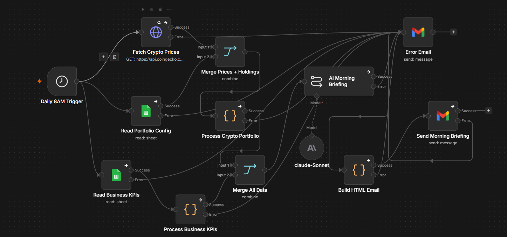
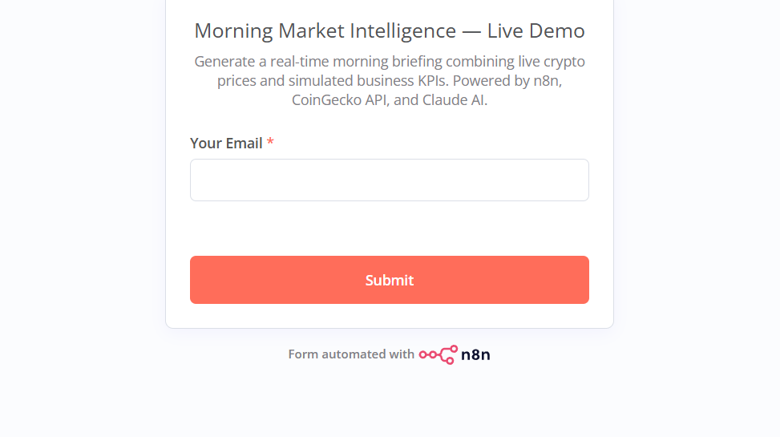
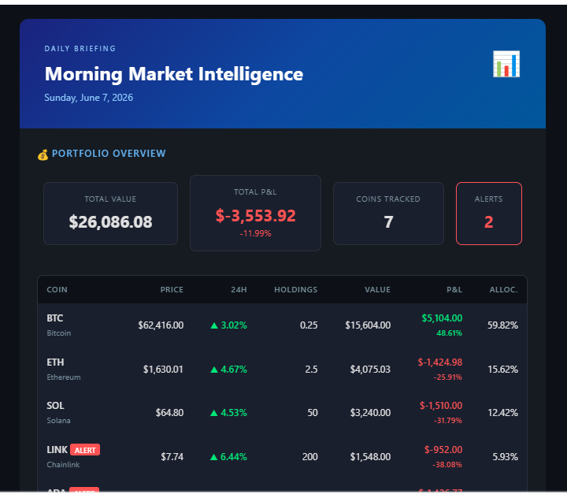
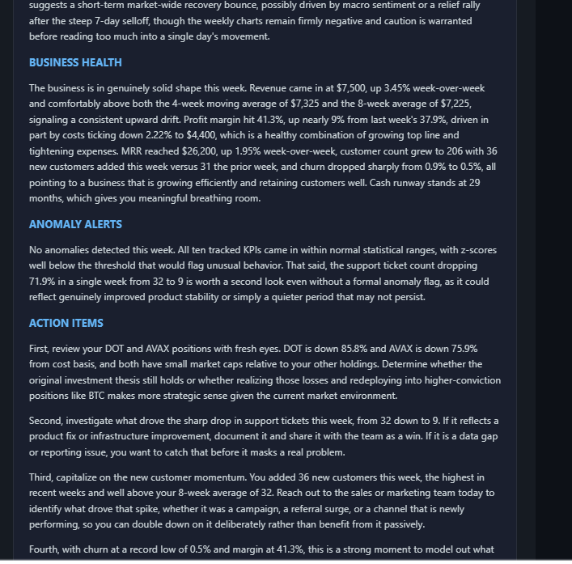

# Morning Market Intelligence

AI-powered daily briefing that combines live cryptocurrency portfolio tracking with business KPI analysis. Pulls real-time crypto prices from CoinGecko, reads simulated business metrics from Google Sheets, detects anomalies, and uses Claude AI to generate an actionable morning report — delivered as a styled HTML email every weekday.

Built with [n8n](https://n8n.io) · [Claude AI](https://anthropic.com) · [CoinGecko API](https://www.coingecko.com/en/api) · Google Sheets · Gmail

---

## Live Demo

**Enter your email to receive a real-time morning briefing in ~30 seconds:**

https://omar-ai0.app.n8n.cloud/form/a4c46a1c-bbd2-4caf-82a0-0fe70dda0ce8

The demo pulls live crypto prices at the moment you submit, combines them with simulated business data, runs the AI analysis, and emails you the full styled report.

---

## The Problem

Decision-makers juggle multiple data sources every morning — portfolio dashboards, business metrics spreadsheets, market news. Pulling together a clear picture across investments and operations means switching between tabs, doing mental math, and hoping you don't miss something important. There's no single view that says "here's what matters today, here's what moved, and here's what you should do about it."

## The Solution

This workflow merges two live data streams into one AI-analyzed morning briefing. Every weekday at 8 AM CET, it:

1. **Fetches live crypto prices** from CoinGecko API (BTC, ETH, SOL, ADA, LINK, DOT, AVAX) with 24h and 7d change data
2. **Reads portfolio holdings** from a Google Sheet and merges them with live prices
3. **Calculates portfolio metrics** — current value, P&L per coin, allocation percentages, and flags any coin that moved more than 5% in 24 hours
4. **Reads business KPIs** from a second Sheet tab (52 weeks of revenue, costs, margins, MRR, churn, customer count, support tickets, cash runway)
5. **Detects anomalies** — any metric deviating more than 2 standard deviations from its 8-week trend
6. **Generates an AI briefing** using Claude Sonnet 4.6 — portfolio performance, market movers, business health, anomalies, and action items
7. **Sends a styled HTML email** with a dark fintech theme

---

## Architecture

    Daily 8AM Trigger
           |
           |---> Fetch Crypto Prices (CoinGecko API, with retry)
           |         |
           |---> Read Portfolio Config (Google Sheets)
           |         |
           |         v
           |    Merge Prices + Holdings
           |         |
           |         v
           |    Process Crypto Portfolio (JavaScript)
           |         | P&L, allocation %, 24h alerts
           |         |
           |         v
           |    Merge All Data <----------------+
           |         |                          |
           |         v                          |
           |    AI Morning Briefing (Claude)    |
           |         |                          |
           |         v                          |
           |    Build HTML Email                |
           |         |                          |
           |         v                          |
           |    Send Morning Briefing           |
           |                                    |
           |---> Read Business KPIs (Google Sheets)
           |         |
           |         v
           +---> Process Business KPIs (JavaScript)
                     WoW trends, moving averages, z-score anomaly detection

All data-fetching and processing nodes have error handling configured. If any node fails, an error notification is sent to the admin.

---

## Data Streams

### Stream 1 — Crypto Portfolio

Live data from CoinGecko (free, no API key required):

| Coin | Tracked Metrics |
|------|----------------|
| BTC, ETH, SOL, ADA, LINK, DOT, AVAX | Current price, 24h change, 7d change, market cap, volume |

Holdings and buy prices are stored in a Google Sheet tab. The workflow merges live prices with your holdings to calculate current value, P&L, and allocation.

**Alert threshold:** Any coin with more than 5% 24h movement gets an ALERT badge.

### Stream 2 — Business KPIs

Simulated SaaS business data (WeeklyKPIs tab):

| Metric | Description |
|--------|-------------|
| weekly_revenue | Gross revenue for the week |
| weekly_costs | Operating costs |
| profit_margin | Revenue minus costs as a percentage |
| mrr | Monthly recurring revenue |
| churn_rate | Customer churn percentage |
| customer_count | Total active customers |
| new_customers | New customers added that week |
| support_tickets | Support tickets opened |
| avg_ticket_resolution_hrs | Average resolution time |
| cash_runway_months | Months of cash remaining |

**Anomaly detection:** Each metric is compared against its 8-week moving average. If the current value deviates more than 2 standard deviations (z-score above 2), it gets flagged.

---

## Signal Logic

### Crypto Alerts

| Condition | Result |
|-----------|--------|
| 24h change above +5% | ALERT badge (upward) |
| 24h change below -5% | ALERT badge (downward) |
| Otherwise | Normal display |

### Business Anomaly Detection

| Step | Method |
|------|--------|
| Collect last 8 weeks | Rolling window |
| Calculate mean and std dev | Per metric |
| Compute z-score | (current - mean) / std_dev |
| Flag if abs(z-score) above 2 | Anomaly alert with direction and expected range |

### Trend Classification

| Trend | Condition |
|-------|-----------|
| Up | Recent average exceeds earlier average by more than 2% |
| Down | Recent average trails earlier average by more than 2% |
| Stable | Within 2% |

---

## Email Output

The daily email features a dark fintech theme:

- **Header** — blue gradient banner with report date
- **Portfolio Overview** — 4 cards: total value, total P&L, coins tracked, alert count
- **Positions Table** — every coin with price, 24h change, holdings, value, P&L, allocation. ALERT badges on volatile coins.
- **Business Dashboard** — 8 KPI cards with current value, WoW change, trend, anomaly flags
- **Anomaly Alerts** — red section listing flagged metrics with z-scores and expected ranges
- **AI Analysis** — Claude-generated briefing with portfolio commentary, business health, and action items
- **Footer** — data attribution and disclaimer

---

## Node-by-Node Breakdown

| Node | Type | Purpose |
|------|------|---------|
| **Daily 8AM Trigger** | Schedule Trigger | Fires Mon-Fri at 08:00 Europe/Prague |
| **Fetch Crypto Prices** | HTTP Request | CoinGecko API call with retry on failure |
| **Read Portfolio Config** | Google Sheets | Reads holdings and buy prices |
| **Read Business KPIs** | Google Sheets | Reads 52 weeks of business metrics |
| **Merge Prices + Holdings** | Merge | Joins live prices with portfolio by coin ID |
| **Process Crypto Portfolio** | Code (JavaScript) | P&L, allocation %, flags movers above 5% |
| **Process Business KPIs** | Code (JavaScript) | WoW trends, moving averages, anomaly detection |
| **Merge All Data** | Merge | Combines crypto and business into one payload |
| **AI Morning Briefing** | Basic LLM Chain | Claude generates the morning analysis |
| **Claude Sonnet 4.6** | Anthropic Chat Model | LLM sub-node (temp 0.3, max 1500 tokens) |
| **Build HTML Email** | Code (JavaScript) | Renders dark-themed HTML with all sections |
| **Send Morning Briefing** | Gmail | Delivers the email |
| **Error Email** | Gmail | Centralized error handler for all nodes |

---

## Sample Data

The CSV contains 52 weeks of simulated SaaS metrics:

| Column | Description | Example |
|--------|-------------|---------|
| week_ending | End of business week | 2026-06-01 |
| weekly_revenue | Gross revenue ($) | 7500 |
| weekly_costs | Operating costs ($) | 4400 |
| profit_margin | Profit as decimal | 0.413 |
| mrr | Monthly recurring revenue ($) | 26200 |
| churn_rate | Churn as decimal | 0.005 |
| customer_count | Active customers | 206 |
| new_customers | New this week | 36 |
| support_tickets | Tickets opened | 9 |
| avg_ticket_resolution_hrs | Avg resolve time (hrs) | 3.1 |
| cash_runway_months | Cash remaining (months) | 29 |

---

## Import and Run

### Prerequisites
- n8n v2.0+ (Cloud or self-hosted)
- Google Cloud project with Sheets API and Gmail API enabled
- Google OAuth2 credentials configured in n8n
- Anthropic API key
- No CoinGecko API key needed (free public endpoint)

### Steps
1. Download `workflow/morning-market-intelligence.json` from this repo
2. In n8n: click Menu then Import from File and select the JSON
3. Connect your credentials: Google Sheets OAuth2, Gmail OAuth2, Anthropic API
4. Create a Google Sheet with two tabs: PortfolioConfig (columns: coin_id, symbol, holdings, buy_price_usd) and WeeklyKPIs (import the CSV from sample-data folder)
5. Update both Google Sheets nodes to point to your spreadsheet
6. Update the Gmail node with your recipient email
7. Click Execute Workflow to test and check your inbox
8. Toggle Active to ON and click Publish to enable daily scheduling

---

## Repository Structure

    morning-market-intelligence/
    ├── README.md
    ├── LICENSE
    ├── workflow/
    │   └── morning-market-intelligence.json
    ├── sample-data/
    │   └── business-kpis-52-weeks.csv
    └── screenshots/
        ├── workflow-canvas.png
        ├── demo-form.png
        ├── email-top.png
        └── email-bottom.png

---

## Tech Stack

| Tool | Role |
|------|------|
| **n8n** v2.11+ | Workflow automation platform |
| **Claude Sonnet 4.6** | AI-generated morning briefing (Anthropic) |
| **CoinGecko API** | Live cryptocurrency price data (free) |
| **Google Sheets** | Portfolio config and business KPI data |
| **Gmail** | HTML email delivery |
| **JavaScript** | Portfolio calculations, anomaly detection, HTML template |

---

## Disclaimer

This project uses simulated business data for demonstration purposes. Crypto prices are real-time from CoinGecko but portfolio holdings are fictional. Nothing in this workflow constitutes financial advice.

## License

MIT
